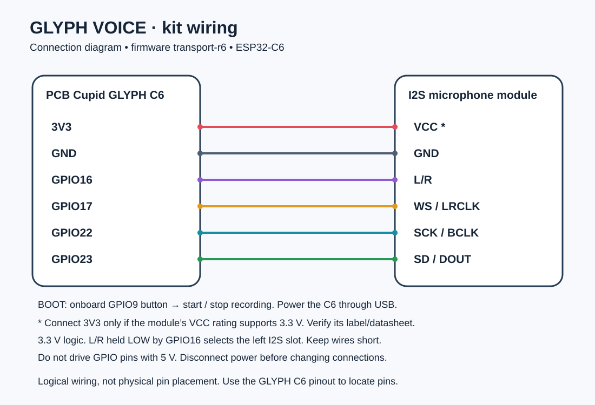

# GLYPH VOICE Kit

Build a button-operated speech-to-text kit using a GLYPH C6, an I2S microphone,
and your Android phone. The board captures sound; the phone transcribes it locally
or, if you explicitly configure it, sends audio to your cloud speech provider.

1. [Hardware: parts, wiring and how audio travels](HARDWARE.md)
2. [Firmware: download, flash and configure Wi-Fi](FIRMWARE.md)
3. [App: install, transcribe, choose local/cloud and summarize](APP.md)
4. [Connection: automatic discovery and troubleshooting](CONNECTION.md)
5. [Photos folder](photos/README.md) — reserved for photos to be added by the maintainer.

Download the matching APK and firmware from [Releases](https://github.com/pcbcupid/Glyph-Voice/releases).
Use the release's SHA256SUMS to check downloaded files. This kit does not use the
phone's microphone, an SD card, or a cloud account in local mode.
